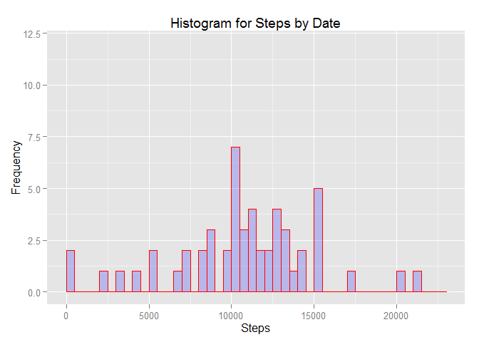
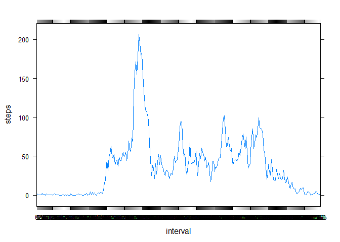
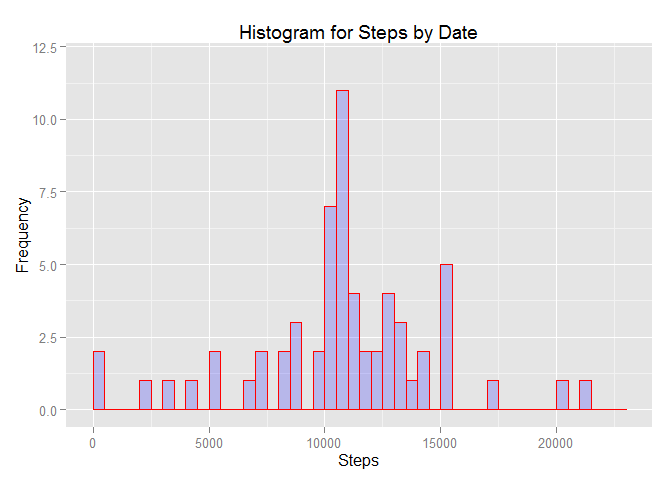
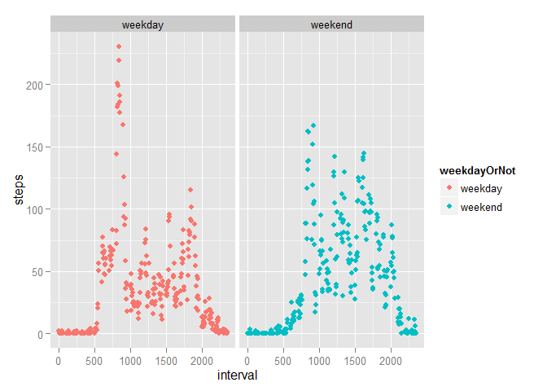

# Reproducible Research: Peer Assessment 1

## Init program


```r
library('ggplot2')
library('lattice')
library('xtable')
library('dplyr')
library('timeDate')
```

## Loading and preprocessing the data


```r
dfOriginal <- read.table(unz("activity.zip", "activity.csv"), header=T, quote="\"", sep=",") # , nrows=30
df <- dfOriginal[complete.cases(dfOriginal),]
df$interval <- factor(df$interval)
df$date <- as.Date(df$date , "%Y-%m-%d")
str(df)
```

```
## 'data.frame':	15264 obs. of  3 variables:
##  $ steps   : int  0 0 0 0 0 0 0 0 0 0 ...
##  $ date    : Date, format: "2012-10-02" "2012-10-02" ...
##  $ interval: Factor w/ 288 levels "0","5","10","15",..: 1 2 3 4 5 6 7 8 9 10 ...
```


## What is mean total number of steps taken per day?

*For this part of the assignment, you can ignore the missing values in the dataset.*

1. Make a histogram of the total number of steps taken each day


```r
dfSumByDate <- aggregate(steps ~ date, data = df, FUN = sum)

# hist(dfSumByDate$steps, breaks=seq(0, 24000, by=1000), main="Steps by date")

# qplot( dfSumByDate$steps, geom="histogram", 
#     binwidth = 1000, xlim=c(0,24000), fill=I("blue"), col=I("red"), alpha=I(.2), 
#     xlab = "Steps", main = "Histogram for Steps by Date")

# http://www.r-bloggers.com/how-to-make-a-histogram-with-ggplot2/
g <- ggplot(dfSumByDate, aes(steps))
g + geom_histogram(breaks=seq(0, 23000, by=500), binwidth=1000, col="red", fill="blue", alpha = .2) + 
    labs(title="Histogram for Steps by Date") + labs(x="Steps", y="Frequency") + 
    xlim(c(0, 23000)) + ylim(c(0, 12))
```



2. Calculate and report the mean and median total number of steps taken per day

- The **mean** total number of steps taken per day is 1.0766189\times 10^{4}
- The **median** total number of steps taken per day is 10765


## What is the average daily activity pattern?

1. Time series plot of the average number of steps taken

*Make a time series plot (i.e. type = "l") of the 5-minute interval (x-axis) and the average number of steps taken, averaged across all days (y-axis)*


```r
dfMeanByInterval <- aggregate(steps ~ interval, data = df, FUN = mean)

xyplot(steps ~ interval,
       data = dfMeanByInterval,
       type = "l")
```



2. Which 5-minute interval, on average across all the days in the dataset, contains the maximum number of steps?

<table border=1>
<tr> <th>  </th> <th> interval </th> <th> steps </th>  </tr>
  <tr> <td align="right"> 104 </td> <td> 835 </td> <td align="right"> 206.17 </td> </tr>
  <tr> <td align="right"> 105 </td> <td> 840 </td> <td align="right"> 195.92 </td> </tr>
  <tr> <td align="right"> 107 </td> <td> 850 </td> <td align="right"> 183.40 </td> </tr>
  <tr> <td align="right"> 106 </td> <td> 845 </td> <td align="right"> 179.57 </td> </tr>
  <tr> <td align="right"> 103 </td> <td> 830 </td> <td align="right"> 177.30 </td> </tr>
  <tr> <td align="right"> 101 </td> <td> 820 </td> <td align="right"> 171.15 </td> </tr>
   </table>

- The 5-minute interval, on average across all the days in the dataset, containing the maximum number of steps is the interval 835 with an average of  206.1698113 steps in those 5 minutes.


## Imputing missing values

*Note that there are a number of days/intervals where there are missing values
(coded as NA). The presence of missing days may introduce bias into some
calculations or summaries of the data.*

1. Calculate and report the total number of missing values in the dataset
(i.e. the total number of rows with NAs)


```r
colSums(is.na(dfOriginal))
```

```
##    steps     date interval 
##     2304        0        0
```

```r
# or 
nrow(dfOriginal) - nrow(df)
```

```
## [1] 2304
```

- There are 2304 rows with missing values


2. Devise a strategy for filling in all of the missing values in the dataset. The
strategy does not need to be sophisticated. For example, you could use
the mean/median for that day, or the mean for that 5-minute interval, etc.

- I will use the mean for that 5-minute interval

3. Create a new dataset that is equal to the original dataset but with the
missing data filled in.


```r
dfMeanByIntervalLen = nrow(dfMeanByInterval)

getMeanByIntervalForNAs <- function(intervals, steps)
{
    res = c()
    intervalsLen = length(intervals)
    for(i in 1:intervalsLen)
    {
        found = steps[i]
        if(is.na(found))
        {
            for(j in 1:dfMeanByIntervalLen)
            {
                if(dfMeanByInterval$interval[j] == intervals[i])
                {
                    found = dfMeanByInterval$step[j]
                    break
                }
            }
        }
        res <- c(res, found)
    }
    res
}

df <- mutate(dfOriginal, steps = getMeanByIntervalForNAs(interval, steps))
```

- The number of NAs in the step column must be 0. Lets check with : sum(is.na(df$steps)) = 0 !

4. Make a histogram of the total number of steps taken each day and Calculate
and report the mean and median total number of steps taken per day. Do
these values differ from the estimates from the first part of the assignment?
What is the impact of imputing missing data on the estimates of the total
daily number of steps?


```r
dfSumByDate <- aggregate(steps ~ date, data = df, FUN = sum)

g <- ggplot(dfSumByDate, aes(steps))
g + geom_histogram(breaks=seq(0, 23000, by=500), binwidth=1000, col="red", fill="blue", alpha = .2) + 
    labs(title="Histogram for Steps by Date") + labs(x="Steps", y="Frequency") + 
    xlim(c(0, 23000)) + ylim(c(0, 12))
```



- The **mean** total number of steps taken per day is 1.0766189\times 10^{4}
- The **median** total number of steps taken per day is 1.0766189\times 10^{4}
- The impact of imputing missing data on the estimates of the total
daily number of steps are 
-- higher frequency but relatively identical
-- really small difference with mean and median total number of steps taken per day


## Are there differences in activity patterns between weekdays and weekends?

*For this part the weekdays() function may be of some help here. Use the dataset
with the filled-in missing values for this part.*

1. Create a new factor variable in the dataset with two levels – “weekday”
and “weekend” indicating whether a given date is a weekday or weekend
day.


```r
getWeekdayOrNotClass <- function(dates)
{
    res = c()
    datesLen = length(dates)
    for(i in 1:datesLen)
    {
        found <- 'weekend'
        if(isWeekday(dates[i]))
        {
            found <- 'weekday'
        }
        res <- c(res, found)
    }
    res
}

df <- mutate(df, weekdayOrNot = getWeekdayOrNotClass(date))

df$weekdayOrNot <- factor(df$weekdayOrNot)
```

2. Make a panel plot containing a time series plot (i.e. type = "l") of the
5-minute interval (x-axis) and the average number of steps taken, averaged
across all weekday days or weekend days (y-axis). The plot should look
something like the following, which was creating using simulated data:
Your plot will look different from the one above because you will be using
the activity monitor data. Note that the above plot was made using the lattice
system but you can make the same version of the plot using any plotting system
you choose


```r
dfWeekOrNot <- aggregate(steps ~ weekdayOrNot + interval, data = df, FUN = mean)

#qplot(interval, steps, data = dfWeekOrNot, color = weekdayOrNot, geom = c("point", "smooth"), method = "lm", facets = .~weekdayOrNot)

g <- ggplot(dfWeekOrNot, aes(x=interval, y=steps)) + aes(colour = weekdayOrNot)
g + geom_point() + facet_grid(. ~ weekdayOrNot)
```



